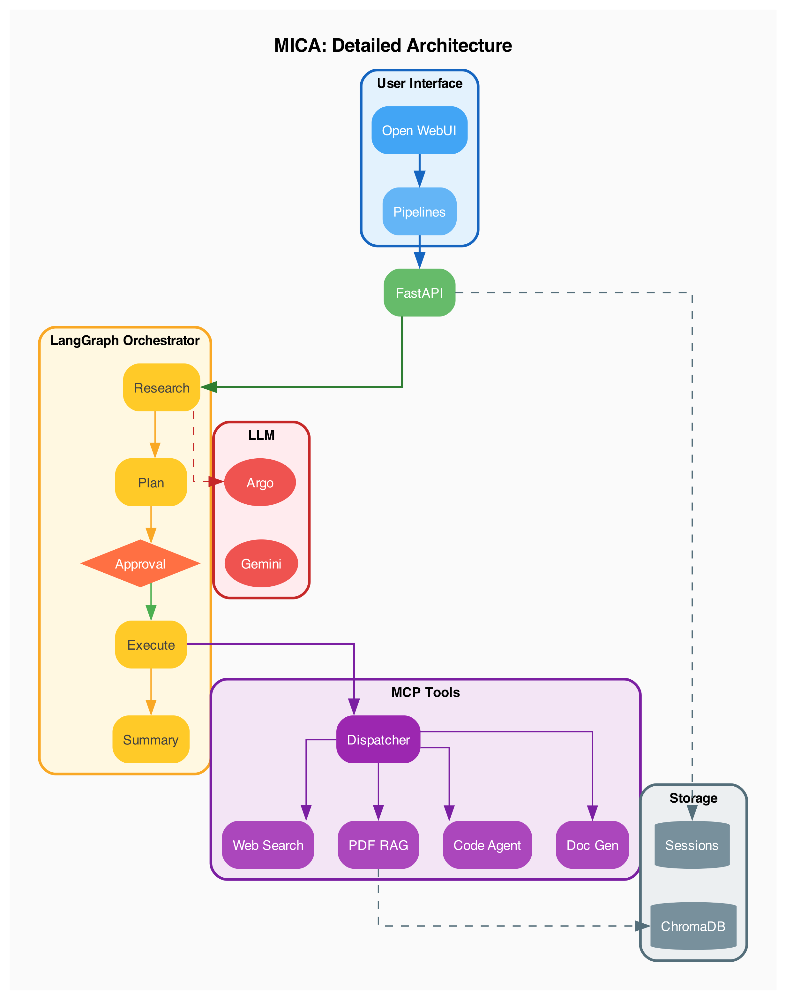
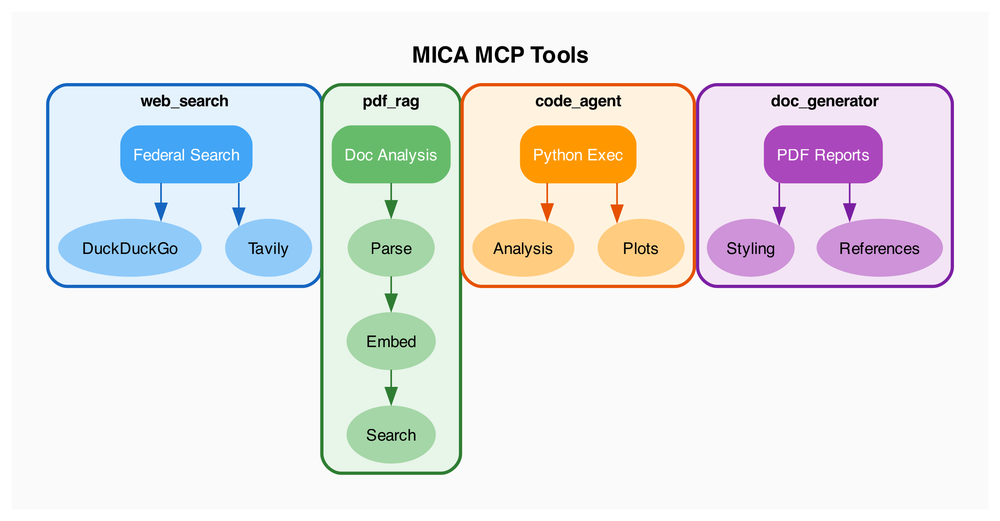

# MICA Architecture

## High-Level Design

MICA (Materials Intelligence Co-Analyst) is a multi-agent system for critical materials supply chain analysis. It uses LangGraph for orchestration and implements a human-in-the-loop workflow pattern.

```
┌─────────────────────────────────────────────────────────────┐
│                      User Interface                          │
│  (Open WebUI chat interface)                                │
└────────────────────────┬────────────────────────────────────┘
                         │ HTTP Streaming
┌────────────────────────▼────────────────────────────────────┐
│                   Pipelines Server                           │
│  • Implements Open WebUI pipelines protocol                 │
│  • Handles session management and polling                   │
│  • Streams progress updates to UI                           │
└────────────────────────┬────────────────────────────────────┘
                         │ REST API
┌────────────────────────▼────────────────────────────────────┐
│                    MICA Backend API                          │
│  • FastAPI with REST + WebSocket endpoints                  │
│  • Session state management                                 │
│  • Credential handling                                      │
└────────────────────────┬────────────────────────────────────┘
                         │
┌────────────────────────▼────────────────────────────────────┐
│                 LangGraph Orchestrator                       │
│                                                              │
│  ┌──────────┐   ┌──────────┐   ┌──────────┐   ┌──────────┐ │
│  │ Research │──▶│  Plan    │──▶│ Approval │──▶│ Execute  │ │
│  └──────────┘   └──────────┘   └────┬─────┘   └────┬─────┘ │
│                                     │              │        │
│                              [Human-in-loop]       ▼        │
│                                            ┌──────────────┐ │
│                                            │   Summary    │ │
│                                            └──────┬───────┘ │
│                                                   │         │
│                                            ┌──────▼───────┐ │
│                                            │   Feedback   │ │
│                                            └──────────────┘ │
└────────────────────────┬────────────────────────────────────┘
                         │
    ┌────────────────────┼────────────────────┐
    │                    │                    │
┌───▼───┐          ┌─────▼─────┐        ┌─────▼─────┐
│  MCP  │          │    LLM    │        │  Storage  │
│ Tools │          │ Providers │        │           │
│       │          │           │        │           │
│• web  │          │• Argo API │        │• Sessions │
│• pdf  │          │• Gemini   │        │• ChromaDB │
│• code │          │           │        │           │
│• docs │          │           │        │           │
└───────┘          └───────────┘        └───────────┘
```

### Complete System Architecture



The detailed architecture diagram shows all components, tools, and data flows.

### Workflow State Machine


## Component Architecture

### 1. Pipelines Server (`ui/pipelines_server.py`)

**Purpose**: Bridge between Open WebUI and MICA backend

**Key Features**:
- Implements Open WebUI pipelines protocol
- Session tracking across conversations
- Progress streaming during execution
- Follow-up question handling

**Endpoints**:
```python
@app.get("/v1/models")      # List available models (MICA pipeline)
@app.post("/v1/chat/completions")  # Main chat endpoint with streaming
```

**Session Management**:
```python
sessions: Dict[str, str] = {}  # chat_id -> mica_session_id

def extract_session_id_from_messages(messages) -> Optional[str]:
    """Extract MICA session ID from previous assistant messages"""

def is_new_query(message, has_prior_session) -> bool:
    """Detect if message is new query vs follow-up"""
```

### 2. MICA Backend API (`backend/mica/api/`)

**Purpose**: REST API for session management and workflow control

**Key Endpoints**:
```python
POST /api/v1/query           # Submit new analysis query
GET  /api/v1/session/{id}    # Get session status and results
POST /api/v1/session/{id}/approve   # Approve/reject analysis plan
POST /api/v1/session/{id}/feedback  # Submit follow-up or feedback
GET  /api/v1/session/{id}/artifacts # List session artifacts
GET  /api/v1/session/{id}/artifact/{type}/{file}  # Serve artifact files
```

**Session State**:
```python
class AgentState(TypedDict):
    session_id: str
    query: str
    status: WorkflowStatus  # INITIAL, RESEARCHING, PLAN_PROPOSED, etc.
    plan: List[PlanStep]
    tool_results: Dict[str, Any]
    final_summary: Optional[str]
    artifacts: List[Dict]
```

### 3. LangGraph Orchestrator (`backend/mica/agents/`)

**Purpose**: Multi-agent workflow coordination with interrupt points

**Workflow Nodes**:
```python
def conduct_preliminary_research(state) -> AgentState:
    """Initial query analysis - determines simple vs complex"""

def generate_plan(state) -> AgentState:
    """Creates structured analysis plan with tool assignments"""

def execute_plan(state) -> AgentState:
    """Runs plan steps, invokes MCP tools"""

def generate_final_summary(state) -> AgentState:
    """Synthesizes results, generates PDF report"""

def handle_feedback(state) -> AgentState:
    """Processes follow-up queries"""
```

**Interrupt Points** (Human-in-the-Loop):
- `await_approval`: Pauses for user to approve/reject plan
- `await_feedback`: Pauses after results for follow-up questions

**State Transitions**:
```
INITIAL → RESEARCHING → PLAN_PROPOSED → AWAITING_APPROVAL
                ↓                              ↓
         (simple query)              EXECUTING → COMPLETED
                ↓                              ↓
         AWAITING_FEEDBACK ←───────────────────┘
                ↓
         (follow-up) → RESEARCHING
                ↓
         (done) → END
```

### 4. MCP Tools (`backend/mica/mcp_tools/`)

**Purpose**: Specialized analysis capabilities

| Tool | Purpose | Key Features |
|------|---------|--------------|
| `web_search` | Federal document search | DuckDuckGo, Tavily, SerpAPI providers |
| `pdf_rag` | PDF analysis | ChromaDB for semantic search |
| `excel_handler` | Spreadsheet analysis | Read/filter/transform Excel/CSV |
| `code_agent` | Python execution | Data analysis, visualization |
| `doc_generator` | PDF reports | Professional formatting, references |
| `simulation` | Supply chain models | Placeholder for GCMat, RELOG |



**Tool Registration Pattern**:
```python
@register_tool
class WebSearchTool(MCPTool):
    name = "web_search"
    description = "Search federal documents and web sources"

    def execute(self, input_data: dict) -> ToolResult:
        # Implementation
```

### 5. LLM Integration (`backend/mica/llm/`)

**Purpose**: Abstracted LLM access with multiple providers

**Factory Pattern**:
```python
def create_llm(provider: str = None, model_id: str = None) -> BaseLLM:
    """
    Creates LLM instance based on configuration
    Supports: Argo (Claude, GPT) and Gemini
    """
```

**Available Models** (Argo):
- `claudesonnet45` - Claude Sonnet 4.5 (default)
- `claudeopus4` - Claude Opus 4
- `gpt4o` - GPT-4o
- `gemini25flash` - Gemini 2.5 Flash

### 6. Session Logging (`backend/mica/logging/`)

**Purpose**: Comprehensive session tracking and artifact storage

**Session Directory Structure**:
```
sessions/{session_id}/
├── metadata.json      # Session metadata and status
├── query.txt          # Original user query
├── plan.json          # Analysis plan with reasoning
├── approval.json      # Approval decision
├── agent_logs/        # Per-agent execution logs
│   ├── orchestrator.log
│   ├── web_search.log
│   └── code_agent.log
├── search_results/    # Web search results
├── artifacts/
│   ├── plots/         # Generated visualizations
│   ├── data/          # Computed data files
│   └── code/          # Executed code snippets
└── report_*.pdf       # Final generated report
```

## Configuration

### Environment Variables

```bash
# LLM Configuration
MICA_LLM_PROVIDER=argo              # argo or gemini
MICA_DEFAULT_MODEL=claudesonnet45   # Model ID
ARGO_USERNAME=your_username         # For Argo API

# Server Configuration
MICA_HOST=0.0.0.0
MICA_PORT=8000
MICA_SESSION_DIR=./sessions

# Search Configuration
MICA_SEARCH_PROVIDER=duckduckgo     # duckduckgo, tavily, serpapi

# RAG Configuration
MICA_CHROMA_DIR=./chroma_db
MICA_EMBEDDING_MODEL=all-MiniLM-L6-v2
```

### Pydantic Settings

Configuration is managed via `backend/mica/config.py`:
```python
from mica.config import config

# Access settings
provider = config.llm.llm_provider
model = config.llm.default_model
session_dir = config.server.session_dir
```

## Testing Strategy

### Unit Tests

**Tool tests**: Test individual MCP tools
```python
def test_web_search():
    tool = WebSearchTool()
    result = tool.execute({"query": "USGS rare earth"})
    assert result.status == ToolStatus.SUCCESS
```

### Integration Tests

**Workflow tests**: Test full orchestration flow
```python
def test_simple_query_workflow():
    state = create_initial_state(session_id, "What is lithium?")
    state = conduct_preliminary_research(state)
    assert state["metadata"]["simple_query"] == True
    assert state["final_summary"] is not None
```

### Running Tests

```bash
cd backend

# Install dev dependencies
pip install -e ".[dev]"

# Run all tests
pytest

# Run with coverage
pytest --cov=mica

# Run specific test file
pytest tests/test_tools.py -v
```

## Running MICA

### Backend Server

```bash
cd backend
pip install -r requirements.txt
python -m mica.api.main
# Runs at http://localhost:8000
```

### Pipelines Server (for Open WebUI)

```bash
cd ui
python pipelines_server.py
# Runs at http://localhost:9099
```

### With Docker

```bash
docker-compose up
# Backend: http://localhost:8000
# Open WebUI: http://localhost:3000
```

## Directory Structure

```
MICA/
├── backend/
│   ├── mica/
│   │   ├── agents/           # LangGraph orchestration
│   │   │   ├── graph.py      # Workflow definition
│   │   │   ├── orchestrator.py
│   │   │   └── state.py      # AgentState schema
│   │   ├── api/              # FastAPI application
│   │   │   ├── main.py
│   │   │   ├── routes.py
│   │   │   └── websocket.py
│   │   ├── llm/              # LLM providers
│   │   │   ├── factory.py
│   │   │   ├── argo.py
│   │   │   └── gemini.py
│   │   ├── mcp_tools/        # Analysis tools
│   │   │   ├── web_search.py
│   │   │   ├── pdf_rag.py
│   │   │   ├── code_agent.py
│   │   │   ├── doc_generator.py
│   │   │   └── ...
│   │   ├── logging/          # Session logging
│   │   └── config.py         # Configuration
│   ├── sessions/             # Session storage
│   └── requirements.txt
├── ui/
│   ├── pipelines_server.py   # Open WebUI integration
│   └── pipes/                # Legacy pipe implementation
├── docs/
│   ├── ARCHITECTURE.md       # This document
│   ├── generate_architecture.py
│   └── *.png                 # Architecture diagrams
├── .env                      # Environment configuration
├── docker-compose.yml
└── README.md
```
