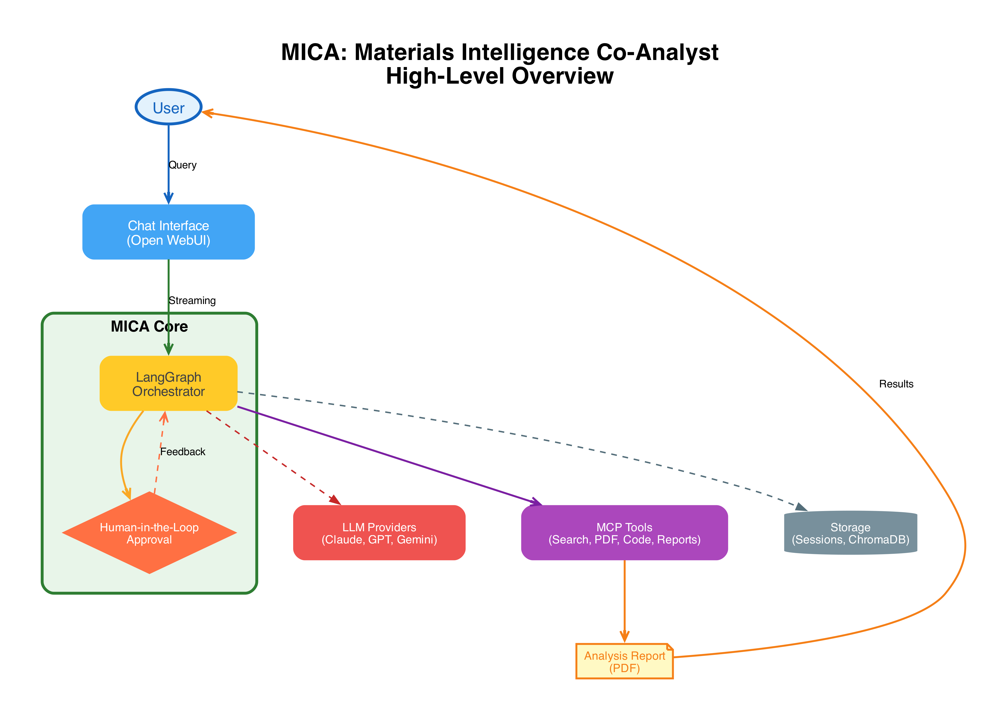
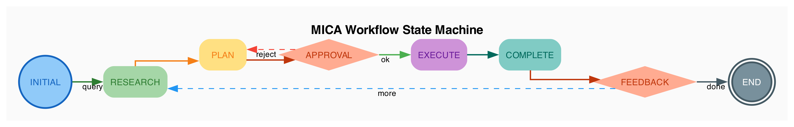

# MICA: Materials Intelligence Co-Analyst

## AI Research Agent for Critical Materials Analysis

MICA is an AI agent designed to help analysts, researchers, and decision-makers investigate questions about critical materials supply chains. MICA combines the power of large language models with human expertise to deliver thorough, trustworthy analysis using a variety of analysis tools, documents, and data at its disposal.  

---

## What MICA Does

MICA acts as a knowledgeable research agent that can:

- **Search and analyze** documents, scientific reports, and authoritative web sources. 
- **Process and understand** PDF reports, Excel spreadsheets, and data files
- **Generate insights** through data analysis and visualization
- **Produce professional reports** with proper citations and references

MICA helps you find answers faster while keeping you in control while researching rare earth element supply chains, analyzing mineral production trends, or investigating trade patterns. 

---

## How It Works

### 1. Ask Your Question
Start by asking MICA any question about critical materials. Simple question, for instance:
- *"What are the current supply risks for lithium?"*
- *"How has cobalt production changed over the past decade?"*
- *"What federal policies address critical mineral supply chains?"*

Simple queries can be answered with the backend LLM alone. MICA can handle complex queries with a full agentic workflow. 

### 2. Review the Plan
For complex questions, MICA creates an analysis plan outlining the steps it will take. You review and approve this plan before any analysis begins, ensuring the approach aligns with your needs.

### 3. Watch the Analysis Unfold
MICA executes the approved plan, searching relevant sources, analyzing documents, and processing data. You can follow along as the analysis progresses.

### 4. Receive Your Results
MICA delivers a comprehensive summary with:
- Key findings and insights
- Supporting evidence and citations
- Data visualizations when relevant
- A PDF report

### 5. Ask Follow-Up Questions
Ask follow-up questions, request deeper analysis, or explore related topics. MICA remembers the context of your session.

---

## Key Features

### Human-in-the-Loop Design
MICA keeps humans in control. You approve analysis plans before execution and can guide the research direction at any point. This ensures the AI works *with* you, not *for* you.

### Trusted Sources
MICA prioritizes authoritative sources including USGS mineral commodity reports, DOE assessments, documents, and peer-reviewed research.

### Local Document Analysis
Upload your own PDFs and data files. MICA can search and analyze your private document collections alongside public sources.

### Data Analysis & Visualization
Beyond text analysis, MICA can process spreadsheets, perform statistical analysis, and generate charts and graphs to illustrate trends and patterns.

### Professional Reports
Every analysis session can produce a formatted PDF report suitable for sharing with stakeholders, complete with executive summary, findings, and references.

---

## Workflow at a Glance

The diagram above shows how MICA moves through different stages, with checkpoints where you can provide input, request changes, or guide the analysis.

---

## Use Cases

### Supply Chain Risk Assessment
Identify potential vulnerabilities in critical material supply chains by analyzing production data, trade patterns, and geopolitical factors.

### Policy Research
Quickly locate and synthesize information from federal documents, regulations, and policy announcements related to critical minerals.

### Market Analysis
Analyze production trends, price movements, and demand forecasts using data from authoritative sources.

### Literature Review
Rapidly survey research reports and technical documents to understand the current state of knowledge on a topic.

### Custom Analysis
Combine multiple data sources and analysis approaches to answer specific research questions tailored to your needs.

---

## Built for Trust

MICA is designed with transparency in mind:

- **Explainable Plans**: See exactly what MICA plans to do before it does it
- **Source Attribution**: Every finding links back to its source
- **Session Logging**: Complete records of all searches, analyses, and results
- **Human Oversight**: You remain in control throughout the process

---
